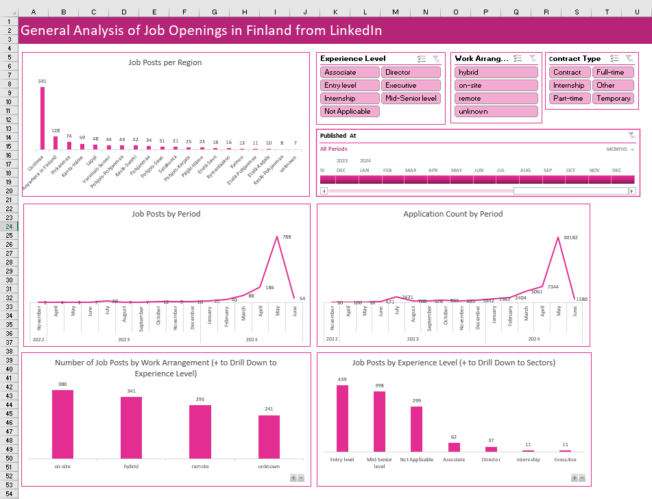
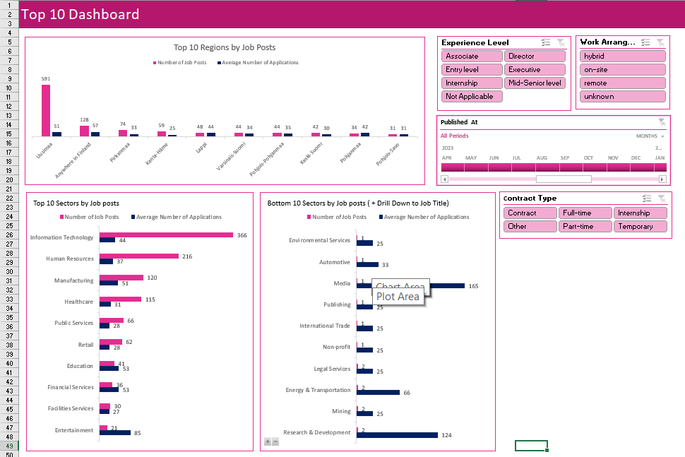
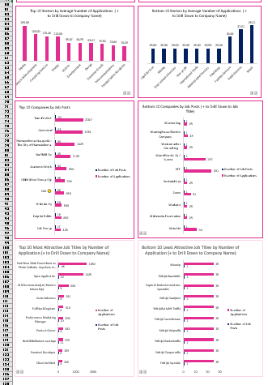
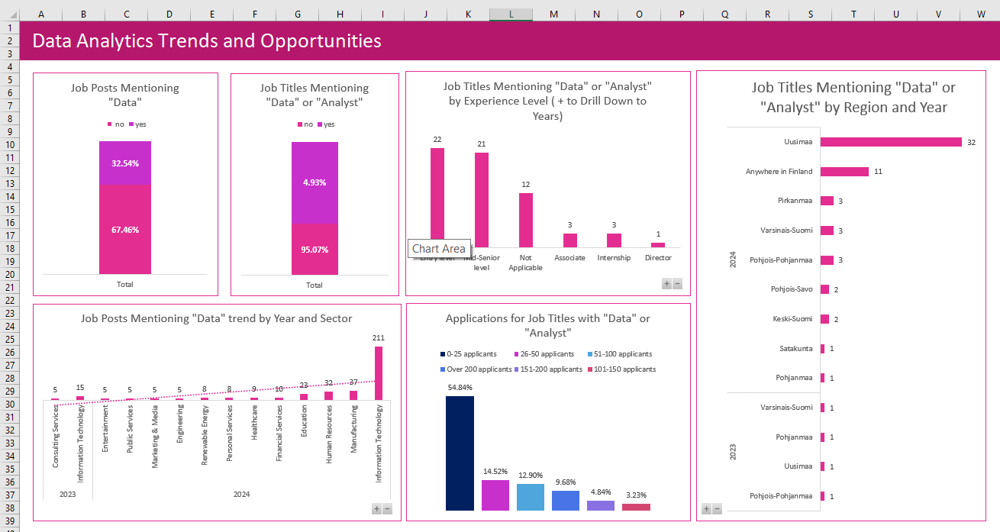

# LinkedIn Job Posts Analysis 2022-2024 in Finland

## Introduction
The dataset was obtained from LinkedIn using the LinkedIn Jobs Scraper from the APIFY marketplace, spanning the time from November 2022 to June 1, 2024. According to LinkedIn (Post a Job on LinkedIn page), a job post will remain active until the poster manually closes it, or it will automatically close after six months. Therefore, the dataset cannot be considered a very precise data source. The dataset was made for my personal practice in data analysis and my personal interest in obtaining a job as a data analyst in Finland. However, it can be presented as a general snapshot of the job market in Finland from 2022 to 2024. 

We have no information about when the vacancies are closed (after what time), so some interesting insights are possibly missing, such as how quickly positions for analysts are closed and how many candidates are needed to find the right one. Some data may not be accurate due to the lack of initial data; for example, I had to fill in missing fields left empty by job posters. Some job descriptions are not informative and lack details, such as location discrepancies. Some job posts are dummies created to gather personal data or analyze the market of candidates with no intention of hiring anyone.

## Research Purpose
The purpose of this research is to find out the trends and the current state of the Finnish job market based on LinkedIn job adverts and to answer some specific questions:

1. How difficult is finding a job as a data/business analyst/ data-related specialist in Finland?
2. Where should you live to get employed as a data/business analyst or data-related specialist?
3. What companies and sectors are seeking data-related jobs?
4. What are companies offering in terms of work arrangements?
5. What level of experience is most in demand for data professionals?
6. What sectors and jobs should you consider if you need some money to live while doing your pet projects?
7. What sectors should you avoid due to the highest competition rate?

## Data Collection and Preparation
The datasets were derived from LinkedIn using the LinkedIn Jobs Scraper from the APIFY marketplace.

- The first dataset: Location Finland
- The second dataset: Location Finland, work type - hybrid
- The third dataset: Location Finland, work type - remote
- The fourth dataset: Location Finland, work type - on-site
- The fifth dataset: Location Suomi, work type - on-site
- Location Suomi, work type - remote: 0 results

### General Preparation
1. Added a `workArrangement` column to each table and populated it with data in Excel.
2. The analysis is made in two ways: data cleaning, transformation, analysis, and visualizations in Excel with full narrative analysis; and data cleaning and transformations in SQL, with data visualization on one board in Power BI with some further explanation.

## Part 1: Excel Analysis of the Job Market in Finland 2022-2024

### Data Cleaning and Transformation

1. **Identify and Mark Duplicate jobUrl Entries**
   - Duplicates are found using: `=IF(COUNTIF(I:I, I2) > 1, "Duplicate", "")`
   
2. **Marking Rows for Deletion**
   - Formula used: `=IF(AND(Q4="Duplicate", P4="unknown", COUNTIFS(I:I, I4, P:P, "<>unknown") > 0), "Delete", "")`
   - Removed duplicates where `jobUrl` and `workArrangement` were the same.
   - 1262 rows left after cleaning.

3. **Populated PublishedAt Column**
   - Populated `publishedAt` column with the date based on all vacancies posted 23 hours ago or later: 01-06-2024 (the day the dataset was scrapped).

4. **Extracted YEAR and Month from publishedAt**
   - Used `TEXT(L2, "mmmm")` and `=YEAR(L2)` to extract the year and month.

5. **Separated Location into Different Columns**
   - Separated `Location` into city, region, and country columns.
   - Populated the region column using another table (in attachment) and `XLOOKUP` function.
   - Populated the rest of the regions manually and unified them to Finnish regions' official names.
   - Labeled rows with missing location data and `workArrangement` marked as remote as "Anywhere in Finland."
   - Assigned the largest city from the listed cities as the location for job ads with multiple cities, mostly Helsinki.
   - Removed job ads where the location in the job description pointed to a country different than Finland or Nordics (2 rows).

6. **Removed Companies without companyId and companyURL**
   - Removed 3 companies, resulting in 1257 rows.

7. **Populated Missing Values in Sector Column**
   - Used `XLOOKUP` function based on `companyID` to populate missing values.
   - Manually populated the remaining 5 rows.

8. **Created SectorGlobal Column**
   - Unified 172 sectors into 41 sectors using `ChatGPT`.
   - Division was made with `XLOOKUP`.

9. **Cleaned ApplicationCount Column**
   - Formula used: `=IF(B2="Be among the first 25 applicants", 25, IF(B2="Over 200 applicants", 201, VALUE(LEFT(B2, FIND(" ", B2) - 1))))`
   - Divided into bins using `IF` function: `=IF(C2<=25,"0-25 applicants", IF(C2<=50,"26-50 applicants", IF(C2<=100,"51-100 applicants", IF(C2<=150,"101-150 applicants", IF(C2<=200,"151-200 applicants","Over 200 applicants")))))`

10. **Added monthNumber Column**
    - Used `MONTH` function to add month numbers.

11. **Counted the Use of "Data" in Job Descriptions**
    - Formula used: `=IF(ISNUMBER(SEARCH("data", H2)), "yes", "no")`

12. **Counted Job Titles Containing "Data" or "Analyst"**
    - Formula used: `=IF(OR(ISNUMBER(SEARCH("data", U2)), ISNUMBER(SEARCH("analyst", U2))), "yes", "no")`
    - Fixed some missing data due to accidental replacement of "no" with an empty space. If you see an awkward word starting with a small letter and a space before it, add "no."

## Part 2: Data Analysis in Excel

All charts are made using PivotCharts, with slicers added to filter the results by chosen work arrangement, work type, or experience level. Excel file with raw data and dashboard to play with is added to the datasets folder.
- **1st Sheet:** General Analysis of Job Openings in Finland from LinkedIn
- **2nd Sheet:** Top 10 Dashboard
- **3rd Sheet:** Data-related Jobs Trends and Opportunities

### General Analysis of Job Openings in Finland from LinkedIn

This dashboard provides an overall snapshot of job availability, distribution, and competition, aligning with the purpose of understanding the trends and current state of the Finnish job market.

1. **Job Posts per Region**:
 
   - The chart indicates that Helsinki has the highest number of job posts, highlighting it as the primary location for a job seeker in Finland, answering where one should live to get employed. Jobs offering opportunities to work remotely are the second highest, but if you are an entry-level professional looking for a remote job, your chances are significantly lower. Also, remote jobs may not be entirely "remote" as many companies prefer you to live in the Uusimaa region, for example.

2. **Job Posts by Period**:
 
   - A significant spike in job postings in May 2024 suggests a seasonal (summer job or kesätyö) and summer vacation increase in job availability, providing insights into the ease of finding a job during specific periods. The dataset was obtained at the end of May 2024. Therefore, April-June contains current open positions, while positions in other periods have not been closed for an extended period due to various reasons. The typical application period is 1-3 months.

3. **Application Count by Period**:
   - The chart shows a peak in applications in May 2024, correlating with the increase in job posts, indicating a highly competitive period for job seekers, especially for just graduated positions and summer vacation replacements. 

4. **Number of Job Posts by Work Arrangement**:
   - On-site and hybrid work arrangements have a relatively high number of job posts, reflecting company preferences and offering insights into what companies are offering in terms of work arrangements. Remote work arrangements offers are also not bad, and you can see how many job posters skip filling this field and add the work arrangement to the title (this could also be due to web scraping issues).

5. **Job Posts by Experience Level**:
   - Entry-level and mid-senior level positions are the most common, indicating a higher demand for professionals at these experience levels. However, if you are already at the executive level, you should use more powerful strategies to find a job. Also, internship offers are very few (and this is the right time for posting them), but this could be due to the personal preferences of job posters, who might choose entry-level or internship positions.

# Job Market Analysis

## Top 10 Regions by Job Posts
- The Uusimaa region leads with 591 job posts, significantly higher than any other region, suggesting a concentration of job opportunitiesPirkanmaa (Tampere) is the second choice if you need a job. My region (Etelä-Karjala) is not on the list, like many other regions. This could be due not only to the lack of job openings but also to the use of other job post services like Jobly and Duunitori.

## Top 10 Sectors by Job Posts
- Information Technology tops the list with 366 job posts, followed by Human Resources and Manufacturing, indicating these are the leading sectors. But the average number of applications is also very high, so the competition is real.

## Bottom 10 Sectors by Job Posts ( + Drill Down to Job Title)
This chart shows the bottom 10 sectors by the number of job posts.  Again, the results are quite interesting. Maybe it is more typical for these sectors to use other hiring methods.

## Top 10 Sectors by Average Number of Applications
- The Media sector has the highest average number of applications (165), indicating high competition for jobs in this sector. R&D and Consulting also get significant attention from candidate. You should have an outstanding CV to be noticed. Healthcare on the 4th place.

## Bottom 10 Sectors by Average Number of Applications
- Sectors such as Legal Services, Mining, and Environmental Services show the lowest average number of applications (25), suggesting lower competition, but they also have only one or two job posts. It's worth mentioning that 25 applicants can mean anywhere from 0-25, since LinkedIn doesn’t provide an accurate number for that bin. 

## Top 10 Companies by Job Posts
- TransPerfect leads the chart with 70 job posts and receives a remarkable 2027 applications. Canonical follows closely with 62 job posts and 1981 applications. Both companies' hiring strategies are very controversial since the same vacancies are posted all the time and attract lots of candidates. Is Hämeenlinna reformatting something, or have they found out that LinkedIn can be a good source of candidates? I can't explain how such a small city made it onto the leaderboard.

## Bottom 10 Companies by Job Posts
- Several companies, including Wunderdog and Westinghouse Electric Company, have only one job post, indicating limited openings. In fact, there are many more of them. If there is only one position posted and lots of applications are received, it is most probably an ‘open application’ to attract people with various experiences for their talent pool.

## Top 10 Most Attractive Job Titles by Number of Applications
- The "Part-time Work from Home as Photo Collector Anywhere in Finland" position is the most attractive, with 1650 applications, showing high interest. As we can see, "open application" and "part-time/remote" keywords are very useful for drawing candidates’ attention. IT-related job titles are also popular, but the secret to their popularity is most probably a good salary and remote opportunities. Based on my experience in IT Talent Acquisition, out of 310 applicants for a Full-Stack Engineer position, 50% are irrelevant, 20% ask for relocation when it is not provided, 10% are monitoring the market to get a salary increase, and the rest are good to proceed further.

## Bottom 10 Least Attractive Job Titles by Number of Applications
- Job titles like "Монтёр" and various "Yrittäjä" positions have the least number of applications (25), indicating low interest. Again, it could be 0 to 25 applications, and there are a lot more of such titles. Searching for "Монтёр" on LinkedIn is absolutely ineffective, even in Russia; it won’t work in Finland either. R-kioski should also choose another strategy to sell their franchise.

# Data-related jobs Trends and Opportunities

## Job Posts Mentioning "Data"
This chart shows that 67.46% of job posts do not mention "data," while 32.54% do. The significant presence of data-related job postings indicates a growing demand for data skills in the job market.

## Job Titles Mentioning "Data" or "Analyst"
An overwhelming 95.07% of job titles mention "data" or "analyst," compared to only 4.93% that do not. This highlights the importance of these keywords in job titles, reflecting the high demand for professionals with data analytics expertise.

## Job Titles Mentioning "Data" or "Analyst" by Experience Level
The chart indicates that entry-level positions account for 22 job titles, while mid-senior level positions account for 21. This distribution suggests opportunities across various experience levels, with a notable demand for entry-level and mid-senior level data analysts. The only problem here is that entry-level position requires 2-3 years of work experience.

## Job Titles Mentioning "Data" or "Analyst" by Region and Year
Uusimaa leads with 32 job titles mentioning "data" or "analyst" in 2024, followed by "Anywhere in Finland" with 11. This regional analysis helps identify where data-related job opportunities are concentrated, with Uusimaa being a significant hub. So, if you are ready for relocation, it is time to move to Helsinki region. If not, you should be very good to be hired for a remote job.

## Job Posts Mentioning "Data" Trend by Year and Sector
The trend shows a gradual increase in job posts mentioning "data" from 2023 to 2024, with Information Technology leading with 211 posts. This trend suggests a growing emphasis on data across various sectors, particularly in IT, HR and Manufacturing.

## Applications for Job Titles with "Data" or "Analyst"
The majority of job titles with "data" or "analyst" receive 0 – 25 applications, highlighting the low competition in this field. The breakdown shows that 54.84% of applications fall in this category, but anyway your CV should be very suitable for ATS.

# Conclusion

### How difficult is finding a job as a data/business analyst/data-related specialist in Finland?
Finding a job as a data/business analyst or data-related specialist in Finland can be challenging but not impossible. With 32.54% of job posts mentioning "data," there is a notable demand for data skills in the job market. However, competition is significant, especially for positions advertised during peak times, which see a high number of applications.

### Where should you live to get employed as a data/business analyst or data-related specialist?
Uusimaa, particularly Helsinki, is the prime location for securing a job as a data/business analyst or data-related specialist. With 32 job titles mentioning "data" or "analyst" in 2024, Uusimaa stands out as the central hub for these opportunities. If relocation is an option, moving to the Helsinki region will significantly increase your chances of employment. For those preferring remote work, ensuring you have a strong resume and relevant skills is crucial.

### What companies and sectors are seeking data-related jobs?
The Information Technology sector leads with 211 job posts mentioning "data," followed by Human Resources and Manufacturing. Companies like TransPerfect and Canonical are top employers, frequently posting data-related jobs. These sectors highlight a growing emphasis on data analytics and related skills across various industries.

### What are companies offering in terms of work arrangements?
Companies offer a mix of work arrangements, with on-site and hybrid positions being relatively common. Remote work opportunities are also available, though not as prevalent as on-site or hybrid arrangements. This distribution reflects company preferences and offers insights into potential flexibility for job seekers.

### What level of experience is most in demand for data professionals?
Entry-level and mid-senior level positions dominate the job market for data professionals. Entry-level positions are particularly notable, accounting for 22 job titles, while mid-senior level positions account for 21. This indicates that opportunities exist for both new graduates and those with several years of experience.

### If you need some money to live while doing your pet projects, what sectors and jobs should you consider?
Information Technology, Human Resources, and Manufacturing are promising sectors to consider. These fields not only have a high number of job posts but also tend to offer opportunities across various experience levels, making them suitable for individuals looking to sustain themselves while working on personal projects.

### What sectors should you avoid due to the highest competition rate?
The Media sector has the highest average number of applications, indicating high competition for jobs in this sector. Similarly, sectors like R&D and Consulting attract significant attention from candidates. Job seekers might find it challenging to stand out in these highly competitive fields and may need to ensure their applications are exceptionally strong.

### Overall Summary
The Finnish job market shows a robust demand for data-related skills, with notable opportunities in IT and related sectors. However, competition is significant, particularly in popular regions (and no jobs are offered in unpopular regions) and during peak periods, making strategic job searching and application submission crucial for success. It is worth adding that LinkedIn job posts are still messy since there are no strict recommendations on how to choose sectors/industries, location, work arrangements, and work types. Staffing agencies, for instance, might list data analytics positions for their clients in the Retail sector under HR, among other discrepancies that can affect the conclusion. Therefore, it is advisable to play with the data, align it to your needs and interests, and try to verify the results.

## Part 2: SQL and Power BI Analysis of the Job Market in Finland 2022-2024
### Step 1: Created the Combined Table
A new table, `LinkedInJobsCombined`, was created to store combined job data from Excel files. This table served as a centralized repository for job posts to facilitate comprehensive analysis.

### Step 2: Populated the Combined Table
The `LinkedInJobsCombined` table was populated with data from various source tables using the `UNION ALL` statement. This process merged data from different sources into a single, unified table, ensuring all job posts were included.

### Step 3: Identified and Marked Duplicates
Duplicate job postings were identified and marked. This step involved counting occurrences of each job URL and marking those with more than one occurrence as duplicates. This ensured each job post was unique, preventing duplicate data from skewing the analysis.

### Step 4: Removed Duplicates and Cleaned Data
Duplicate entries were removed, and the data was cleaned by eliminating entries with unknown or irrelevant values. This included removing companies without proper IDs or URLs and ensuring each job post was accurately represented. Additionally, job posts with mismatched locations (i.e., not in Finland or the Nordics) were deleted.

### Step 5: Fixed Date Format Errors
Date format errors in the `publishedAt` column were corrected to ensure consistency and accuracy. A new column was added to store the correctly formatted dates, ensuring the date information was standardized.

### Step 6: Populated Missing Regions
The `regionFormatted` column was populated based on the location data (regions.csv). This step involved matching job locations to their respective regions using a reference table. Jobs listed as remote or with vague locations were categorized appropriately, ensuring each job post had a valid region.

### Step 7: Populated Sectors
The `sectorGlobal` column was populated using a mapping table (sector_global.csv). This step standardized the sector information for each job post, mapping specific company sectors to broader global sectors. Missing or incorrect sector data was manually updated based on company and job descriptions.

### Step 8: Transformed Application Counts
The `applicationsCount` data was transformed into a numerical format for easier analysis. Textual descriptions of application counts were converted into numerical values, enabling quantitative analysis of application trends.

### Step 9: Counted Keyword Mentions
New columns were added to count the presence of keywords like "data" and "analyst" in job descriptions and titles. This involved scanning the text for these keywords and marking their presence, aiding in analyzing the demand for data-related skills.

### Step 10: Final Data Preparation
Final updates and corrections were made to the dataset. This included setting a standard sector for specific companies, fixing any remaining data inconsistencies, and ensuring all data was ready for analysis. The table was prepared for export and use in Power BI. Some columns are not used in Power BI but I decided to keep them for verification when it is necessary like companyURL and publishedAt. 1257 rows of data (same as in Excel) were obtained as a result of data cleaning and transforming in MSSM.

### SQL File
The complete SQL code used for this project is available in the scripts folder on GitHub. 1257 rows of data (same as in Excel) were obtained as a result of data cleaning and transforming in SSMS.

### Step 11: Power BI

Uploaded the dataset to Power BI using an SQL query. Initially, Month and Year were derived in Power Query Editor, as done before in Excel. A data table was also created to sort months in their normal order, but these steps were not necessary for the purpose of this analysis. The only DAX formulas used were for dynamic titles of the chart based on the user selections in the filter, and measurements for tooltips to list and show company names and job titles (up to 30) for the chosen values in filters.

The PowerBI dashboard displayed in the image provides a comprehensive analysis of job openings in Finland from LinkedIn. The visualizations are designed to address key research questions related to job postings, regional distribution, sector distribution, and the demand for specific job skills. The .pbix file to play with can be found in scripts folder.

The filters for contract type (e.g., full-time, part-time) and work arrangements (e.g., remote, on-site) provide insights into the variety of job types available and their flexibility. By filtering job titles mentioning "Data" or "Analyst," the dashboard can reveal the demand for data-related skills, crucial for those looking to enter or advance in data-focused roles. The user can also choose the experience level.

#### Sector-Specific Hiring Trends
The bar chart for top sectors illustrates which industries are most active in the job market. This helps understand sector-specific hiring trends and workforce demands. The tooltips show the number of job posts, the number of applications, and the average number of applications.

#### Regional Distribution of Job Openings
The regional distribution chart identifies where job openings are concentrated, which can guide job seekers on where to focus their search efforts. Tooltips show what companies posted the job and what titles they used in any region.

